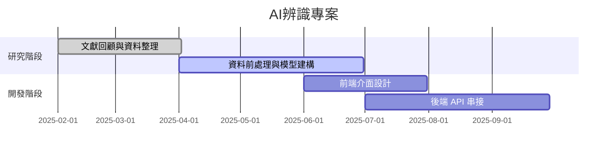

# mermaid_editor_server


## 進去mermaid_editor
```bash
cd  mermaid_editor
```


## 開啟DENO server(記得要先下載[Deno](https://deno.com/))

```bash
deno run -A server.js
```
### 之後服器已啟動，請開啟 http://localhost:8002

## 用以下css來做明確的改變
```css
/* 甘特圖背景整個改成淡黃色 */
.gridBackground rect {
  fill: #fff8e1 !important;
}

/* 甘特圖的 bar 全部變成紅底、黑色字、大字體 */
.taskRect {
  fill: #ff0000 !important;
  stroke: #000 !important;
  stroke-width: 3px !important;
}
.taskText {
  fill: #fff !important;   /* 白色文字 */
  font-size: 20px !important; /* 字大 */
  font-weight: bold !important;
}

/* 左側任務標題變藍色 */
.labelText {
  fill: #1e90ff !important;
  font-size: 18px !important;
  font-weight: bold !important;
}

/* 改變標題或日期 */
.titleText {
  fill: #8b008b !important;  /* 紫色 */
  font-size: 24px !important;
  font-weight: 900 !important;
}
.axisText {
  fill: #000 !important;
  font-size: 16px !important;
  font-style: italic !important;
}
```


## 範例甘特圖mermaid語法


